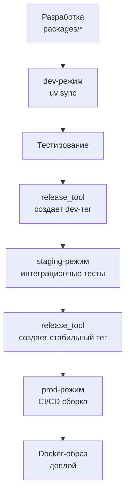

# Концепция процесса разработки

## Общая идея

Проект построен на принципах **микропакетной архитектуры** с **изолированными репозиториями** и **тремя режимами работы** (dev/staging/prod), автоматизированными через **uv workspaces** и **релизный инструментарий**.

## 1. Микропакетная архитектура

Каждый компонент — самостоятельный Python-пакет с собственными зависимостями и сборкой через `hatchling`.

### Структура проекта

```
project/
├── pyproject.toml              # dev-режим
├── staging/pyproject.toml      # staging-режим
├── prod/pyproject.toml         # prod-режим
├── packages/                   # python-пакеты (git submodules)
│   ├── bench-utils/
│   ├── model-interface/
│   └── model-qwen2-5-vl/
└── docker/Dockerfile-uv        # универсальная сборка
```

## 2. Изоляция через git submodules

Каждый python-пакет — **отдельный GitHub-репозиторий**, подключенный как `git submodule`.

**Преимущества:**
- собственная история коммитов, теги версий и ветки;
- изоляцию CI/CD-пайплайнов каждого пакета;
- возможность открывать Pull Request-ы независимо от основного проекта.

## 3. Три режима работы

В процессе разработки ML-проектов возникают различные стадии:

### Активная разработка
- Нужна возможность быстро вносить изменения в код python-пакета и сразу видеть результат
- Удобно иметь все пакеты под рукой в editable-режиме
- Требуются dev-зависимости для тестирования и отладки

### Предрелизное тестирование
- Необходимо проверить работоспособность на «почти финальных» версиях
- Важно зафиксировать версии для воспроизводимого тестирования
- Окружение должно быть максимально близко к продакшену

### Продакшен и CI/CD
- Критически важна воспроизводимость сборки
- Нужны только стабильные, протестированные версии
- Минимальный набор зависимостей без dev-инструментов
- Быстрая сборка без лишних компонентов

## 4. Техническая реализация

**uv workspaces** обеспечивает:
- Единый lock-файл и виртуальную среду
- Три отдельных `pyproject.toml` для разных режимов
- Автоматическое управление зависимостями

| Режим | Назначение | Источник пакетов |
|-------|------------|------------------|
| **dev** | Активная разработка | Локальные (editable) |
| **staging** | Предрелизное тестирование | Git dev-теги |
| **prod** | Продакшен и CI/CD | Git стабильные теги |

> 📖 **Подробности:** [Dev-, Staging- и Prod-режимы](02_dev_staging_prod.md)

## 5. Автоматизация релизов

Для ускорения релизов для UV workspace проектов разработан **`release_tool`** ([GitHub](https://github.com/VLMHyperBenchTeam/release_tool))

### Ключевые возможности
- **📦 UV Workspace**: специализация для микропакетной архитектуры
- **🔧 Git submodule**: легкая интеграция в существующие проекты
- **🛡️ Безопасность**: dry-run режим и поэтапное выполнение
- **📊 Семантическое версионирование**: patch/minor/major/dev bumps
- **🧠 LLM-интеграция**: ИИ для генерации осмысленных commit/tag сообщений

### Автоматизирует
- Обнаружение и описание изменений в пакетах
- Создание коммитов, тегов и GitHub-релизов
- Обновление зависимостей между dev/staging/prod режимами
- Управление версиями и dev-ветками

## 6. Docker-сборка

**Универсальный `docker/Dockerfile-uv`** для воспроизводимых деплойментов из uv-окружений.

### Основные принципы
- **Один Dockerfile** для dev и prod режимов
- **Многоступенчатая сборка**: `base` → `deps` → `wheel` → `runtime`
- **Гибкие build-аргументы**: CUDA-версия, базовый образ, CMake
- **Кэширование**: эффективное переиспользование слоев Docker

### ML-специализация
- **Автоматическая сборка `flash-attn`** под нужную CUDA-версию
- **Lock-файл воспроизводимость**: `uv sync --locked`
- **Минимальные runtime-образы**: без исходников и dev-зависимостей
- **Поддержка разных PyTorch-бэкендов**: cu124, cu128

### Архитектура слоев
1. **Базовый**: системные зависимости + статический `uv`
2. **Зависимости**: раздельные слои для dev/prod окружений
3. **Wheel-сборка**: компиляция `flash-attn` с кэшированием
4. **Финальные**: оптимизированные runtime-образы

> 📖 **Подробности:** [Документация по Docker-сборке](07_docker_builder_full.md)

## Workflow разработки



> 💡 **Принцип:** Каждый компонент изолирован, но интегрируется через единую систему управления зависимостями и автоматизированный релизный процесс.
