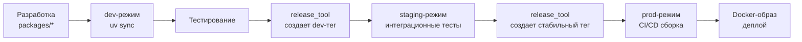

# Концепция процесса разработки

## Общая идея

Проект построен на принципах **микропакетной архитектуры** с **изолированными репозиториями** и **тремя режимами работы** (dev/staging/prod), автоматизированными через **uv workspaces** и **релизный инструментарий**.

## 1. Микропакетная архитектура

Каждый компонент — самостоятельный Python-пакет с собственными зависимостями и сборкой через `hatchling`.

### Структура проекта

```
project/
├── pyproject.toml              # dev-режим
├── staging/pyproject.toml      # staging-режим
├── prod/pyproject.toml         # prod-режим
├── packages/                   # python-пакеты (git submodules)
│   ├── bench-utils/
│   ├── model-interface/
│   └── model-qwen2-5-vl/
└── docker/Dockerfile-uv        # универсальная сборка
```

## 2. Изоляция через git submodules

Каждый python-пакет — **отдельный GitHub-репозиторий**, подключенный как `git submodule`.

**Преимущества:**
- собственная история коммитов, теги версий и ветки;
- изоляцию CI/CD-пайплайнов каждого пакета;
- возможность открывать Pull Request-ы независимо от основного проекта.

## 3. Три режима работы

| Режим | Назначение | Источник пакетов |
|-------|------------|------------------|
| **dev** | Активная разработка | Локальные (editable) |
| **staging** | Предрелизное тестирование | Git dev-теги |
| **prod** | CI/CD и деплой | Git стабильные теги |

> 📖 **Подробности:** [Dev-, Staging- и Prod-режимы](02_dev_staging_prod.md)

## 4. Техническая реализация

**uv workspaces** обеспечивает:
- Единый lock-файл и виртуальную среду
- Три отдельных `pyproject.toml` для разных режимов
- Автоматическое управление зависимостями

**Команды:**
```bash
uv sync --extra cu124                  # dev
uv sync --project staging --frozen     # staging
uv sync --project prod --frozen        # prod
```

## 5. Автоматизация релизов

**`release_tool`** автоматизирует:
- Создание коммитов, тегов и GitHub-релизов
- Генерацию diff-файлов для описаний
- Обновление зависимостей между режимами

## 6. Docker-сборка

**Универсальный `Dockerfile-uv`:**
- Поддержка dev/prod режимов
- Автоматическая сборка `flash-attn`
- Кэширование для разных CUDA-версий

> 📖 **Подробности:** [Документация по Docker-сборке](07_docker_builder_full.md)

## Workflow разработки



## Основные файлы документации

- **[02_dev_staging_prod.md](02_dev_staging_prod.md)** — детальное описание режимов работы
- **[07_docker_builder_full.md](07_docker_builder_full.md)** — полная документация по Docker-сборке
- **[09_torch_backends.md](09_torch_backends.md)** — настройка CUDA-бэкендов PyTorch

---

> 💡 **Принцип:** Каждый компонент изолирован, но интегрируется через единую систему управления зависимостями и автоматизированный релизный процесс.
